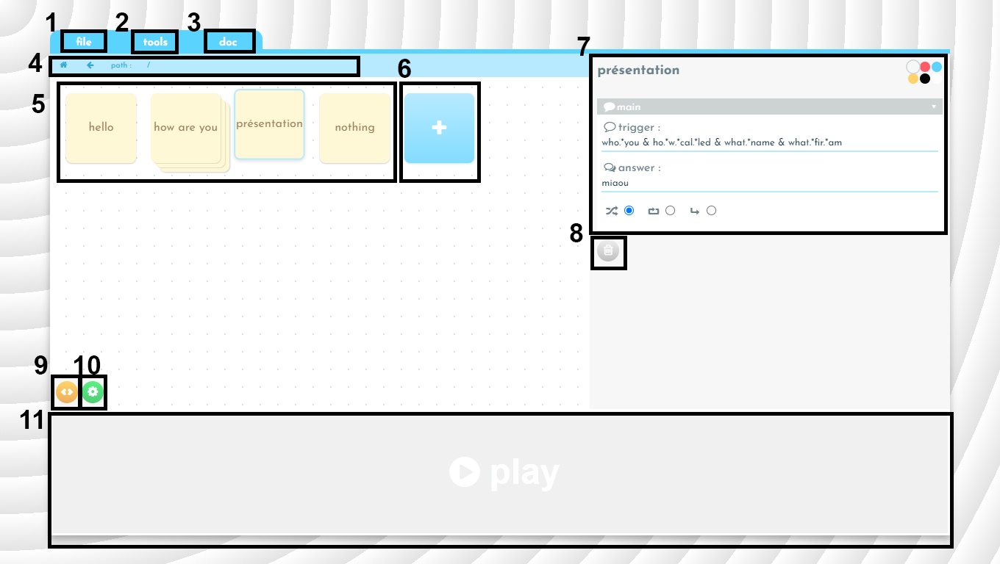

# Miaou

Miaou edits chatbots. It enables you to create and modify a chatbot via a graphic interface.

---

## Other resources

- [Getting started](./doc/getting-started.md)
- [Main concepts](./doc/main-concepts.md)
- [Complete guide](./doc/complete-guide.md)

---

## Interface

1. The **file** drop-down menu enables you to delete the current work via the new button, to **download** a project via the download button or to open a recorded chatbot via the **open** button.
2. The **tools** drop-down menu enables you to select the settings which are displayed in zone 8.
3. If you are here, it is because you have guessed.
4. The navigation bar enables you to know the level of the tree structure you have reached and to navigate within the tree.
5. This is where you will find the boxes. Click on one of them to amend it.
6. Click here to create a new box.
7. This space enables you to change the settings of the selected box.
8. Click here to delete the selected box.
9. This button gives you access to the CSS mode, from where you can select one
   of the available themes or create a new one.
10. This button gives you access to the general settings of the bot.
11. Click on PLAY to access a console which will enable you to test the current chatbot.

## Keyboards shortcuts

- The direction arrows enable you to move within the boxes.
- The **Enter** key enable you to enter a box.
- The Enter key enable you to enter a box.
- The **n** key enables you to create a new box.
- The **Delete** key enables you to delete the selected box.
- **CTRL + C**, **CTRL + X** **CTRL + V** enable you to _copy_, _cut_ and _paste_ a box.
  Beware, the boxes links are not copied.
