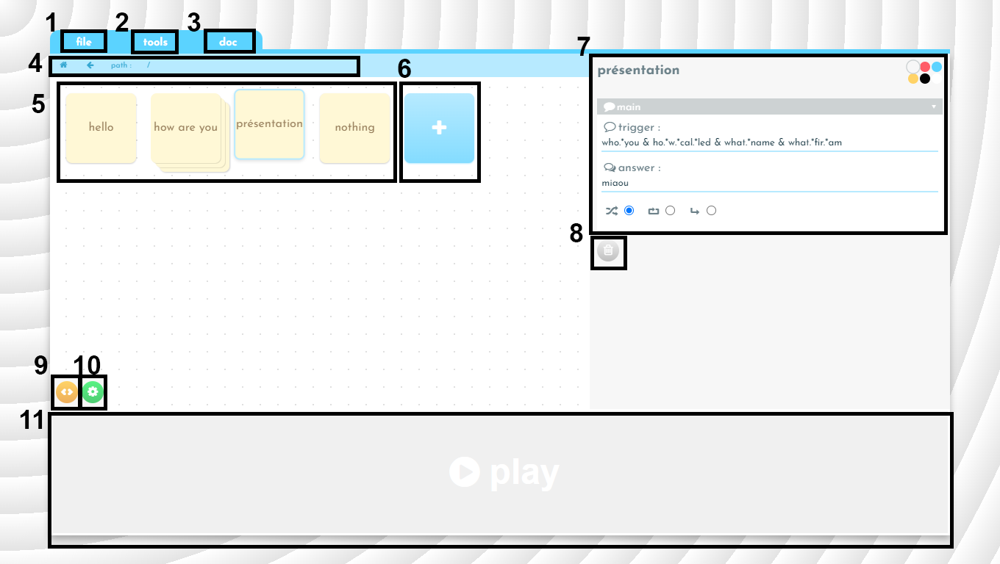

# Miaou

[Version anglaise](../../README.md)

Miaou est un éditeur de chatbot. Il permet de créer et modifier un chatbot en passant par une interface graphique.

---

## Autres resources

- [Miaou](https://achtaitaipai.github.io/Miaou/)
- [Premiers pas](./premiers-pas.md)
- [Principes fondamentaux](./principes-fondamentaux.md)
- [Guide Complet](./guide-complet.md)

---

## Interface

1. Le menu déroulant **file**, fermet d'effacer le travail en cours via le bouton **new**, de télécharger le projet via le bouton **download** ou d'ouvrir un chatbot enregistré via le bouton **open**.
2. Le menu déroulant **tools** permet de sélectionner les paramètre qui apparaissent dans la zone 7.
3. Si vous êtes ici c'est que vous avez deviné.
4. La barre de navigation permet de savoir à quel niveau de l'arborescence on se trouve et de naviguer dans l'arborescence.
5. C'est ici que se trouvent les boîtes. Cliquez sur l'une d'entre elles pour la modifier.
6. Cliquez ici pour créer une nouvelle boîte.
7. Cet espace permet de modifier les paramètres de la boîte sélectionnée.
8. Cliquez ici pour supprimer la boîte sélectionnée.
9. Ce bouton donne accès au mode CSS, depuis lequel vous pourrez choisir parmis les apparences disponibles ou en créer une nouvelle.
10. Ce bouton donne accès aux paramètres généraux du bot.
11. En cliquant sur PLAY vous aurez accès à une console permettant d'essayer le chatbot en cours.

## Raccourcis claviers

- Les flèches directionnelles permettent de se déblacer dans les boîtes.
- La touche **Entrée** permet d'entrer dans une boîte.
  La touche **Retour** permet, avec la plupart des navigateurs, de revenir - au niveau supérieur de l'arborescence.
- la touche **n** permet de créer une nouvelle boîte.
- la touche **Suppr** permet de supprimer la boîte sélectionnée.
  **CTRL + C** **CTRL + X** **CTRL + V** permettent de copier, couper et coller une boîte. Attention les liens des boîtes ne sont pas copiés.

## Credits

- Design : [**_Colin Thil_**](http://www.martiansparlor.com/)
- Code : **_Achtaitaipai_**
